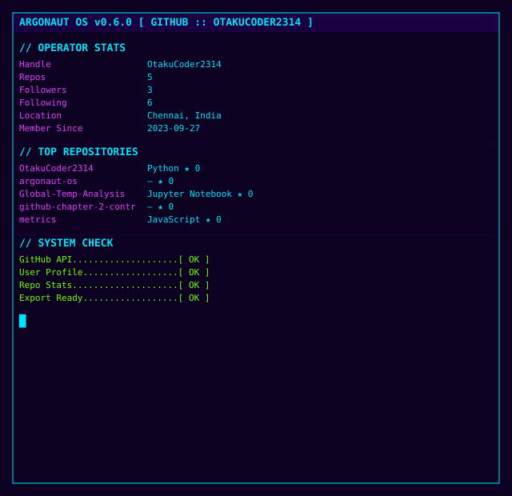
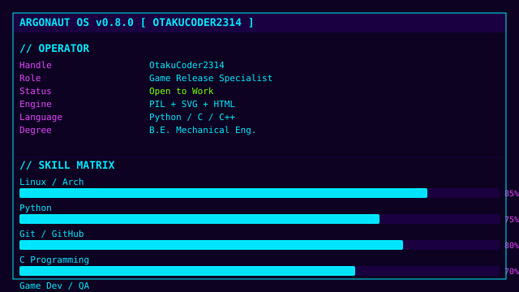
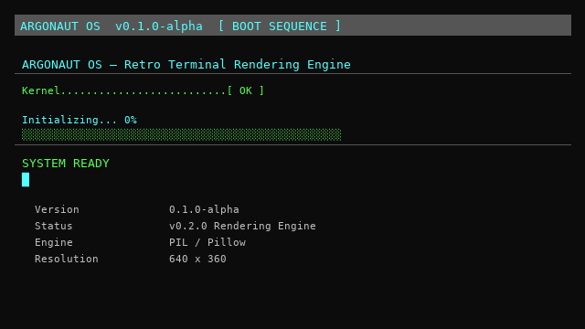

<!-- ARGONAUT OS — GitHub Profile README v0.9.1 -->
<div align="center">



<br/>



<br/>



</div>

---

## `> whoami`

```
Handle      OtakuCoder2314
Status      Open to Work
Location    Chennai, Tamil Nadu, India
Degree      B.E. Mechanical Engineering — PSG College of Technology (2022–2026)
CGPA        7.51 / 10
```

---

## `> skills --list`

| Domain | Tools |
|---|---|
| **Programming** | Python · HTML (BASIC) . C · C++ (learning) |
| **Operating Systems** | Linux (Arch / EndeavourOS) · Windows |
| **Version Control** | Git · GitHub |
| **Engineering** | SolidWorks · ANSYS · OriginPro |
| **Data Analysis** | NumPy · Pandas · Matplotlib · Excel |

---

## `> interests`

`Game Development` `Linux` `Open Source` `Simulation` `Game Physics` `Computer Hardware` `PC Gaming` `Game Preservation`

---

<div align="center">
<sub>Built with ARGONAUT OS · Retro Terminal Rendering Engine</sub>
</div>

